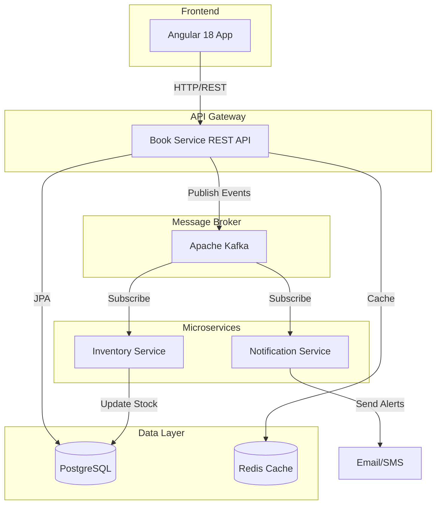
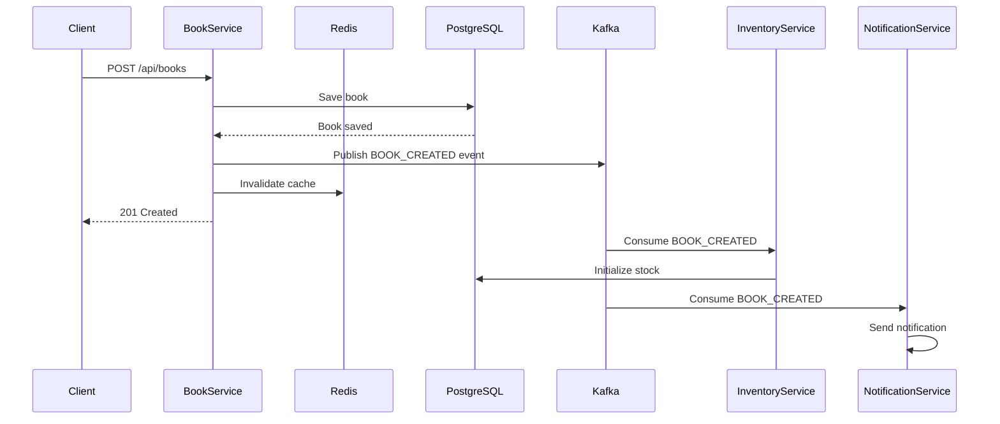

# Event-Driven Microservices Architecture - Book Management System

## System Overview

This is an event-driven microservices system for managing books, built with Spring Boot backend services and Angular 18 frontend.

## Architecture Diagram



## Technology Stack

### Backend
- **Java 17+** - Programming language
- **Spring Boot 3.x** - Application framework
- **Spring Data JPA** - Database access
- **Spring Web** - REST API
- **Spring Kafka** - Event streaming
- **Spring Cache** - Caching abstraction
- **Redis** - Distributed cache
- **PostgreSQL** - Primary database
- **Maven** - Build tool

### Frontend
- **Angular 18** - Frontend framework (compatible with Node 22.13.1)
- **TypeScript** - Programming language
- **RxJS** - Reactive programming
- **Angular Material** - UI components
- **CDK Virtual Scroll** - Virtual scrolling for large datasets

## Database Schema

### Books Table
```sql
CREATE TABLE books (
    id BIGSERIAL PRIMARY KEY,
    isbn VARCHAR(20) NOT NULL UNIQUE,
    title VARCHAR(255) NOT NULL,
    author VARCHAR(255) NOT NULL,
    publisher VARCHAR(255),
    category VARCHAR(100),
    language VARCHAR(50) DEFAULT 'English',
    description TEXT,
    price NUMERIC(10, 2) NOT NULL,
    stock_quantity INTEGER DEFAULT 0 NOT NULL,
    published_date DATE,
    page_count INTEGER,
    cover_image_url TEXT,
    rating NUMERIC(2, 1) DEFAULT 0,
    active BOOLEAN DEFAULT true,
    created_at TIMESTAMP DEFAULT CURRENT_TIMESTAMP,
    updated_at TIMESTAMP DEFAULT CURRENT_TIMESTAMP
);

CREATE INDEX idx_books_isbn ON books(isbn);
CREATE INDEX idx_books_title ON books(title);
CREATE INDEX idx_books_author ON books(author);
CREATE INDEX idx_books_category ON books(category);
```

## Microservices Architecture

### 1. Book Service (Main Service)
**Port**: 8080  
**Responsibilities**:
- CRUD operations for books
- REST API endpoints at `/api/books`
- Pagination support (30 rows per page)
- Redis caching for queries
- Kafka event publishing

**Endpoints**:
- `GET /api/books` - List all books with pagination
- `GET /api/books/{id}` - Get book by ID
- `POST /api/books` - Create new book
- `PUT /api/books/{id}` - Update book
- `DELETE /api/books/{id}` - Delete book
- `GET /api/books/search` - Search books with filters

### 2. Inventory Service
**Port**: 8081  
**Responsibilities**:
- Listen to book events from Kafka
- Track stock levels
- Update inventory when books are created/updated/deleted
- Send low-stock alerts

**Kafka Topics Consumed**:
- `book-events` - All book CRUD operations

### 3. Notification Service
**Port**: 8082  
**Responsibilities**:
- Listen to book events from Kafka
- Send notifications for book operations
- Email/SMS alerts for important events
- Audit logging

**Kafka Topics Consumed**:
- `book-events` - All book CRUD operations

## Event Flow



## Kafka Event Schema

### Book Event
```json
{
  "eventId": "uuid",
  "eventType": "BOOK_CREATED | BOOK_UPDATED | BOOK_DELETED",
  "timestamp": "2026-05-18T05:00:00Z",
  "bookId": 123,
  "book": {
    "id": 123,
    "isbn": "978-0-123456-78-9",
    "title": "Sample Book",
    "author": "John Doe",
    "price": 29.99,
    "stockQuantity": 100
  }
}
```

## Redis Caching Strategy

### Cache Keys
- `book:{id}` - Individual book by ID
- `books:page:{pageNumber}:size:{pageSize}` - Paginated results
- `books:search:{query}:page:{pageNumber}` - Search results

### Cache TTL
- **1 hour** for all cached entries

### Cache Invalidation
- On CREATE: Invalidate all list/search caches
- On UPDATE: Invalidate specific book and all list/search caches
- On DELETE: Invalidate specific book and all list/search caches

## Frontend Architecture

### Component Structure
```
src/app/
├── core/
│   ├── services/
│   │   ├── book.service.ts
│   │   └── notification.service.ts
│   ├── models/
│   │   └── book.model.ts
│   └── interceptors/
│       └── http-error.interceptor.ts
├── features/
│   └── books/
│       ├── book-list/
│       │   └── book-list.component.ts
│       ├── book-detail/
│       │   └── book-detail.component.ts
│       ├── book-form/
│       │   └── book-form.component.ts
│       └── book-delete-dialog/
│           └── book-delete-dialog.component.ts
└── shared/
    ├── components/
    └── pipes/
```

### Virtual Scrolling Implementation
- Uses Angular CDK Virtual Scroll
- Loads data in chunks of 30 rows
- Infinite scroll with pagination
- Optimized rendering for large datasets

## Configuration

### PostgreSQL Connection
```properties
Host: 192.168.1.88
Port: 5437
Database: postgres
Username: postgres
Password: All4one7!
Table: books
```

### Redis Connection
```properties
Host: 192.168.1.88
Port: 30073
Username: default
Password: mypassword
```

### Kafka Configuration
```properties
Bootstrap Servers: localhost:9092
Topic: book-events
Consumer Groups:
  - inventory-service-group
  - notification-service-group
```

## API Response Format

### Success Response
```json
{
  "status": "success",
  "data": {
    "content": [...],
    "page": 0,
    "size": 30,
    "totalElements": 150,
    "totalPages": 5
  }
}
```

### Error Response
```json
{
  "status": "error",
  "message": "Error description",
  "timestamp": "2026-05-18T05:00:00Z"
}
```

## Performance Considerations

1. **Pagination**: Default page size of 30 rows to optimize data transfer
2. **Redis Caching**: 1-hour TTL reduces database load
3. **Virtual Scrolling**: Efficient rendering of large lists in Angular
4. **Async Communication**: Kafka enables non-blocking operations
5. **Connection Pooling**: HikariCP for database connections
6. **Lazy Loading**: Angular modules loaded on demand

## Security Considerations

1. **Input Validation**: Bean Validation on all DTOs
2. **SQL Injection Prevention**: JPA parameterized queries
3. **CORS Configuration**: Restrict allowed origins
4. **Error Handling**: Generic error messages to clients
5. **Authentication**: Ready for JWT/OAuth2 integration

## Deployment Strategy

### Development
- Local PostgreSQL, Redis, and Kafka instances
- Spring Boot DevTools for hot reload
- Angular development server with proxy

### Production
- Containerized services with Docker
- Kubernetes orchestration
- External PostgreSQL and Redis clusters
- Managed Kafka service

## Monitoring and Logging

1. **Spring Boot Actuator**: Health checks and metrics
2. **Structured Logging**: JSON format for log aggregation
3. **Distributed Tracing**: Ready for Sleuth/Zipkin integration
4. **Kafka Monitoring**: Consumer lag tracking

## Next Steps

1. Implement all backend services
2. Set up Angular frontend
3. Integration testing
4. Performance testing
5. Documentation